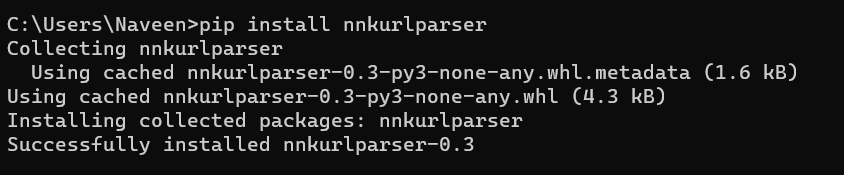
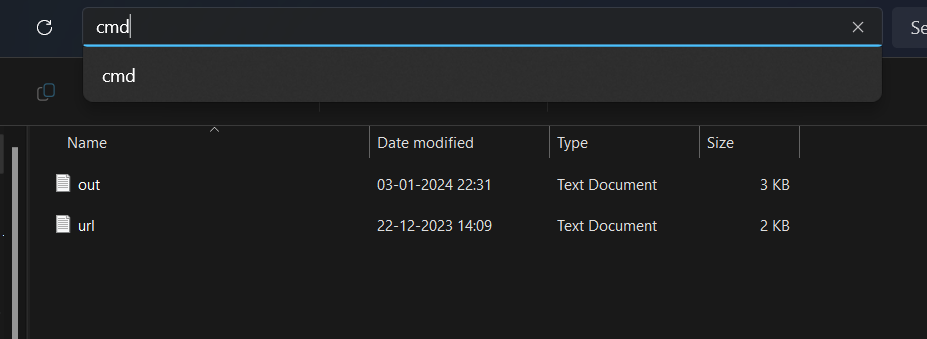
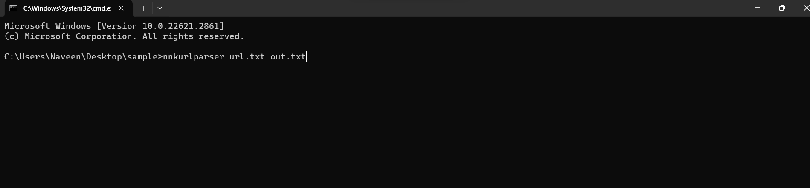

<h1 align="center">
    
</h1>


## Overview
The urlparser script takes a list of URLs as input,parses them and generates a list of unique endpoint URLs by removing path components from each original URL.
This is the tool which is used as a Bugbounty automation tool for splitting endpoints from recon data.
It is used to parser the url according to our desire so we can have a detailed and proper implementation of our attacks for Bugbounty.

## Prerequisites
<div align="left">
    <a href="https://skillicons.dev">
        
    </a>
</div>    
Python installed on our system

## Installation
The Installation can be proceeded further by the following command in the terminal:

Install pip package:

````
pip install nnkurlparser
````
## Usage:
## Importing in a python code:
````
from nnkurlparser import read_urls, main

input_filename = "input.txt"
output_filename = "output.txt"

urls = read_urls(input_filename, output_filename)
print("Parsed URLs:", urls)

# You can also call the main function if needed
# main()
#Remember to replace "input.txt" and "output.txt" with the actual file names you want to use.

````
<h2 align="left">Implementing in Terminal:</h2>
<h2 align="left">Step 1:</h2>
Installing the pip package



<h2 align="left">Step 2:</h2>
Navigating to the folder where the input file is saved and opening the terminal there



<h2 align="left">Step 3:</h2>
After positioning the terminal with the correct directory we have type the following terminal command and at here url.txt is the input file and out.txt is the file in which the output is going to be saved.



## Tool Description
This tools is used to automate the url parser procedure and as a result of which we prioritize and execute the bug bounty process and look for the bugs in a more systematic way!

## Contact Me:
<div align="center"> 
  <a href="mailto:naveennithyakalyan@gmail.com">
    
  </a>
  <a href="https://www.linkedin.com/in/r-naveen-nithya-kalyan-5474bb1b7">
    
  </a>
</div>


 
